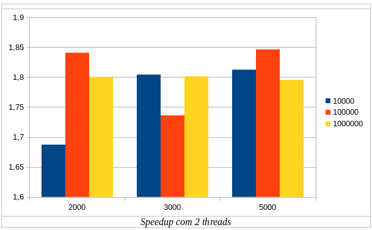
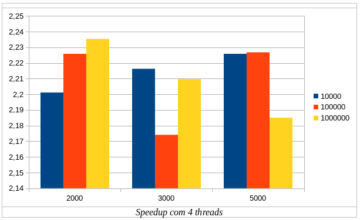
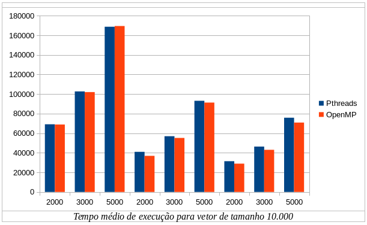
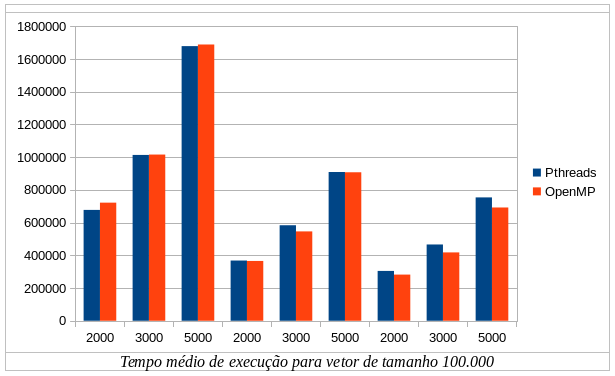
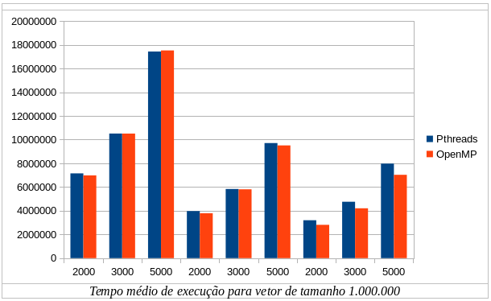
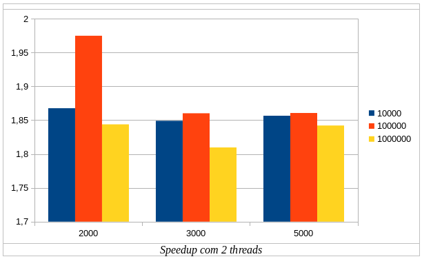
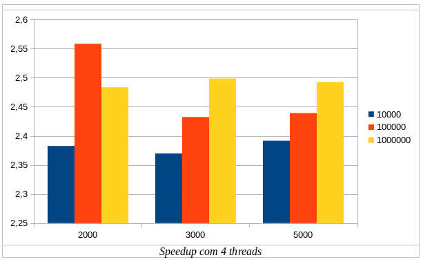

Nome: Jairo Ferreira Gez, Disciplina: ELC1039 - Programação Paralela
----
[Especificações da plataforma utilizada (specs.txt)](specs.txt), [Dados de execuções dos programas (results.csv)](results.csv)
----
## Parte I: Pthreads

1. Explique como se encontram implementadas as 4 etapas de projeto: particionamento, comunicação, aglomeração, mapeamento (use trechos de código para ilustrar a explicação).

- Particionamento: identificar as oportunidades de paralelismo e decompor o problema em tarefas menores.

O seguinte trecho de código divide o processamento realizado para calcular o produto escalar de duas matrizes em várias tarefas, as quais realizam somas parciais do resultado final:

```c
void *dotprod_worker(void *arg)
{
   ...
   for (k = 0; k < dotdata.repeat; k++) {
      mysum = 0.0;
      for (i = start; i < end ; i++)  {
         mysum += (a[i] * b[i]);
      }
   }

   pthread_mutex_lock (&mutexsum);
   dotdata.c += mysum;
   pthread_mutex_unlock (&mutexsum);
   ...
}
```

- Comunicação: definição das estruturas de dados e métodos que serão utilizados para a resolução do problema.

O seguinte trecho de código define a struct dotdata_t que vai conter, entre outras coisas, os dados das duas matrizes e o resultado do produto escalar. 

```c
typedef struct
{
  double *a;
  double *b;
  double c;
  int wsize;
  int repeat;
} dotdata_t;
```
Ainda é definido o mutex que vai regrar o acesso das threads ao resultado do produto escalar.

```c
pthread_mutex_t mutexsum;
```

- Aglomeração: combinação dos resultados das subtarefas, sendo importante a obtenção de um tempo de comunicação inferior ao tempo de processamento.

O seguinte trecho de código mostra a fase de aglomeração, onde os resultados parciais são calculados por cada thread e posteriormente somados ao campo acessivel globalmente.

```c
for (k = 0; k < dotdata.repeat; k++) {
  mysum = 0.0;
  for (i = start; i < end ; i++)  {
      mysum += (a[i] * b[i]);
  }
}

pthread_mutex_lock (&mutexsum);
dotdata.c += mysum;
pthread_mutex_unlock (&mutexsum);
```

- Mapeamento: etapa onde ocorre a distribuição de tarefas entre as threads.

Cabe ao método dotprod_threads esta incumbência.

```c
void dotprod_threads(int nthreads)
{
   int i;
   pthread_t *threads;
   pthread_attr_t attr;

   threads = (pthread_t *) malloc(nthreads * sizeof(pthread_t));
   pthread_mutex_init(&mutexsum, NULL);

   pthread_attr_init(&attr);
   pthread_attr_setdetachstate(&attr, PTHREAD_CREATE_JOINABLE);

   for (i = 0; i < nthreads; i++) {
      pthread_create(&threads[i], &attr, dotprod_worker, (void *) i);
   }
   pthread_attr_destroy(&attr);
   for (i = 0; i < nthreads; i++) {
      pthread_join(threads[i], NULL);
   }
   free(threads);
}
```

2. Considerando o tempo (em microssegundos) mostrado na saída do programa, qual foi a aceleração (speedup) com o uso de threads?

O speedup foi de 1.822 ou 82.2% com o uso de duas threads comparado ao uso de apenas uma.

3. A aceleração se sustenta para outros tamanhos de vetores, números de threads e repetições? Para responder a essa questão, você terá que realizar diversas execuções, variando o tamanho do problema (tamanho dos vetores e número de repetições) e o número de threads (1, 2, 4, 8..., dependendo do número de núcleos). Cada caso deve ser executado várias vezes, para depois calcular-se um tempo de processamento médio para cada caso. Atenção aos fatores que podem interferir na confiabilidade da medição: uso compartilhado do computador, tempos muito pequenos, etc.

Após o cálculo das médias de tempo para 1, 2 e 4 threads, verificou-se que  a aceleração se sustenta, uma vez que conforme cresce o número de threads utilizadas, o desempenho em termos de tempo de execução diminui. As combinações testadas foram vetores de tamanho 10000, 100000 e 1000000 e 2000, 3000 e 5000 repetições, com as configurações testadas 20 vezes cada. 

4.Elabore um gráfico/tabela de aceleração a partir dos dados obtidos no exercício anterior.

Abaixo, os gráficos com os speedups encontrados para 2 e 4 threads.





5.Explique as diferenças entre pthreads_dotprod.c e pthreads_dotprod2.c. Com as linhas removidas, o programa está correto?

A diferença entre os dois programas é que o segundo, com as linhas removidas, não implementa o mutex que controla o resultado final do produto escalar, gerando uma condição de corrida entre as threads. O programa está incorreto.

## Parte II: OpenMP

1. Implemente um programa equivalente a pthreads_dotprod.c usando OpenMP.

O código implementado encontra-se [aqui](openmp/ompsimple.c).

2. Avalie o desempenho do programa em OpenMP, usando os mesmos dados/argumentos do programa com threads POSIX.

A partir dos resultados obtidos, verificou-se que, conforme o número de threads aumenta, o OpenMp se sai melhor em termos de tempo de execução, não importando o tamanho do vetor ou o número de repetições. Abaixo, as tabelas de comparação entre OpenMp e Pthreads.





Foram ainda enconrados os seguintes speedups para 2 e 4 threads usando OpenMp.



